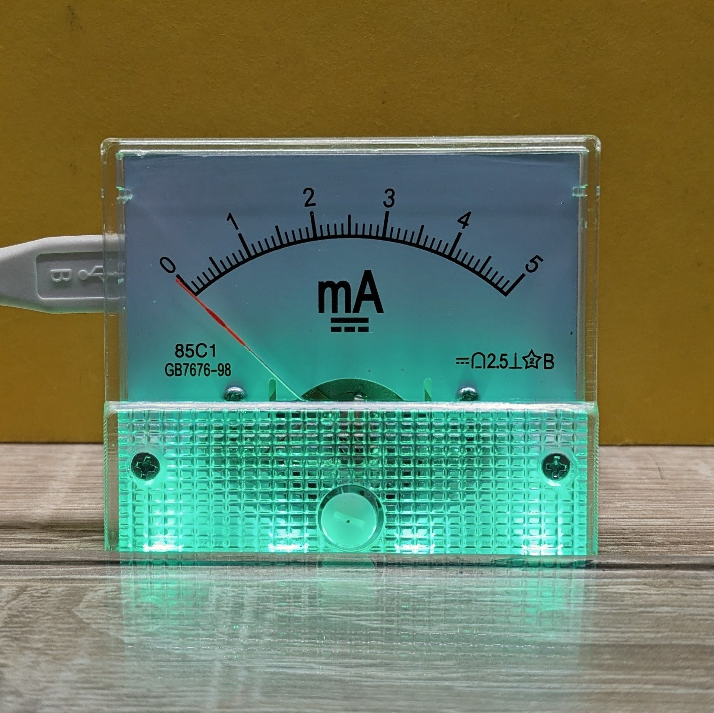
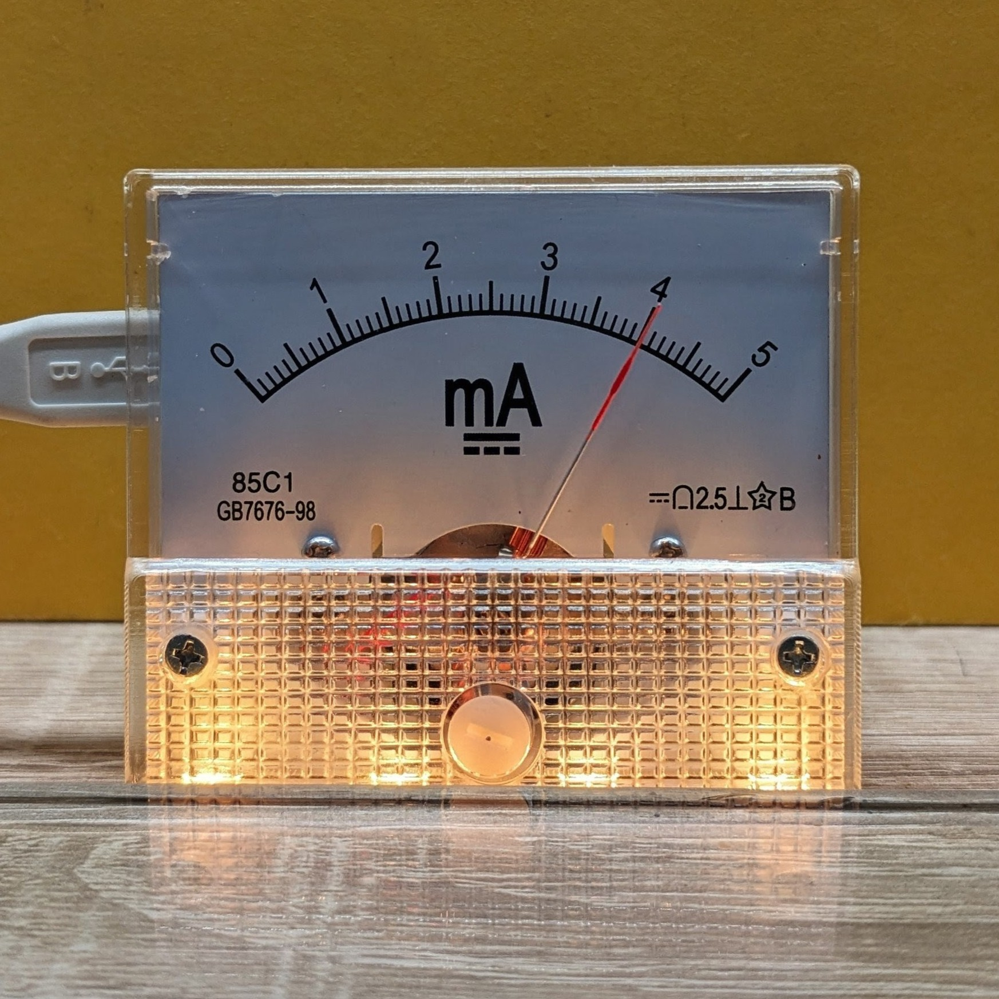
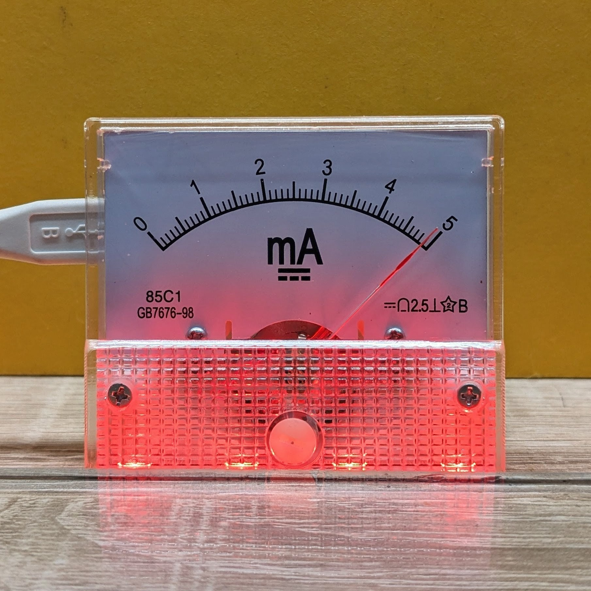

# CPU Load to Raspberry Pi Pico

Display the host machine's CPU load on an analog ammeter (85C1-mA panel meter). The project also drives 4 WS2812 LEDs for a visual color indication. The host script sends CPU usage over USB serial to a Raspberry Pi Pico, and the Pico firmware converts the incoming values to a PWM output for the analog meter and colors for the LEDs.

<div style="display: flex; justify-content: center; gap: 10px;">
  
  
  
</div>

## This repository contains:

- `src/main.cpp` — Firmware for the Pico (PlatformIO project).
- `app/CPU Load to Pico.py` — Host-side Python script that detects the Pico and sends CPU usage over serial.
- `platformio.ini` — PlatformIO configuration for building and uploading the Pico firmware.

## Hardware

- Raspberry Pi Pico
- 85C1-mA DC Analog Current Panel Meter Gauge (referred to below as "analog meter")

Additional hardware used in this project:
- USB-A to micro-USB or USB-C cable (data + power).
- 4 × WS2812 RGB LEDs on a small LED strip.

Wiring notes for the analog meter and WS2812 LEDs

- 85C1-mA Analog Current Panel Meter:
	- The Pico's GPIO cannot safely drive an analog current meter directly. Do NOT connect the panel meter directly to a Pico GPIO pin use a 600 Ohm resistor in series with the ampmeter with scale 0-5mA for proper operation.
	- Ensure the meter's required current range, polarity and reference are matched. If uncertain, consult the meter's datasheet. (do not exceed the Pico pin current limits).
	- The firmware maps CPU load to a PWM value on `ANALOG_OUTPUT_PIN` (see `include/configs.h` — default: 26).

- WS2812 LED strip:
	- Data pin: `LED_STRIP_DATA_PIN` (see `include/configs.h` — default: 27).
	- Power: WS2812s typically require 5 V. Power the strip from VBUS pin on Pico and connect the strip ground to the Pico ground.

Pin mappings (from `include/configs.h`)

- `BAUDRATE` — 9600 (serial communication speed between host and Pico)
- `ANALOG_OUTPUT_PIN` — 26 (PWM mapped output used to drive analog meter)
- `LED_FLASH_PIN` — `LED_BUILTIN` (indicator flash when new data arrives)
- `LED_STRIP_DATA_PIN` — 27 (WS2812 data pin)
- `BRIGHTNESS_BUTTON_PIN` — 4 (button to change brightness)

## How it works (high level)

1. The host Python script measures CPU usage using `psutil`.
2. It detects the Pico by USB vendor ID and opens a serial connection using `pyserial`.
3. The script writes the CPU load as a newline-terminated integer (e.g. `42\n`) once per second.
4. The Pico firmware reads the serial data and reacts accordingly (see `src/main.cpp`).

## Requirements

- Python 3.8+ on the host.
- `pyserial` and `psutil` for the host script.
- PlatformIO (VS Code PlatformIO extension or `pio` CLI) to build/upload firmware.

Install Python dependencies:

```powershell
python -m pip install --user pyserial psutil
```

## Running the host app

1. Make sure the Pico is connected via USB.
2. Run the Python script from the `app/` folder:

```powershell
cd "app"
python "CPU Load to Pico.py"
```

The script will search for a Pico by USB vendor ID and, once found, connect at 9600 baud and send the CPU percentage each second. Example output:

```
12:34:56 Found Raspberry Pi Pico on COM3
12:34:56 Connected to COM3 at 9600 baud.
12:34:57 Sent CPU load: 5%
12:34:58 Sent CPU load: 12%
```

Notes:
- The script uses a vendor ID constant (Raspberry Pi Pico vendor ID). If your board uses a different VID, edit `VENDOR_ID` in the script.
- If the Pico enumerates on a different port or does not expose a VID, you can run the script and modify it to connect to a fixed port (e.g. `COM3`).

## Building & uploading Pico firmware (PlatformIO)

From the repository root, you can build and upload the firmware with PlatformIO. Common commands:

```powershell
# build
platformio run

# build and upload to device
platformio run --target upload

# or using the pio CLI
pio run -t upload
```

If using the PlatformIO VS Code extension, open the project and use the UI (Project Tasks) to Build and Upload.

## Files of interest

- `app/CPU Load to Pico.py` — Host script. It uses `psutil.cpu_percent(interval=1)` and writes values as text over serial.
- `src/main.cpp` — Embedded firmware for reading serial data on the Pico and doing something with the values.

## Troubleshooting

- Permission errors on Windows: ensure you have access to the COM port. Close programs that might be using the serial port (e.g., serial monitors).
- `pyserial` cannot open port: confirm the port name printed by the script and that the Pico is connected.
- If the Pico isn't detected by vendor ID: run `python -m serial.tools.list_ports` or use OS tools to inspect connected USB devices and find the VID/PID.
- If CPU values look wrong or are stuck: check `psutil` is installed and up to date, and confirm the `interval=1` call in the script.

Safety & troubleshooting for meter and LEDs
- If the analog meter doesn't move or moves unpredictably: double-check the driver stage between the Pico and the meter. Monitor the meter input with a multimeter and confirm the driver stage provides the expected current/voltage.
- If unsure about the meter wiring or required drive current, stop and consult the meter's datasheet.

## Example modification ideas

- Send additional system metrics (RAM usage, temperature) from the host.
- Drive a WS2812 LED ring or e-paper display with the received load value.

## License

This project is licensed under GPL-3.0. A copy of the GPL-3.0 license should be provided in a `LICENSE` file in the repository root.

---


References

- A very silly CPU monitor — YouTube: https://www.youtube.com/watch?v=4J-DTbZlJ5I

